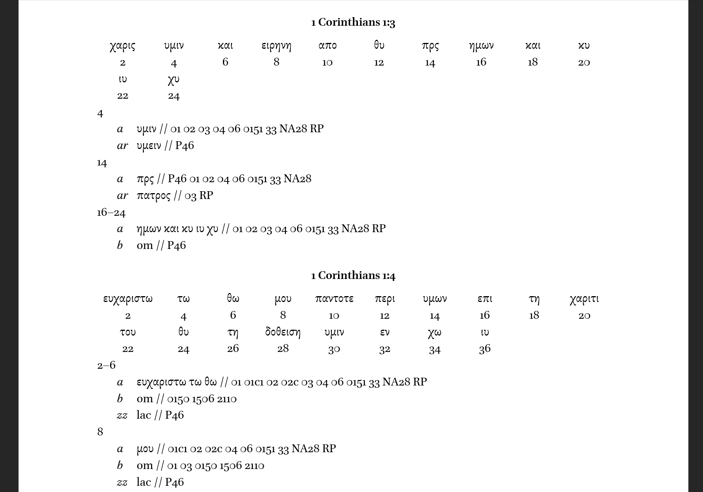

# XML Apparatus to DOCX

This is a small CLI for exporting the XML critical apparatus output of the ITSEE [Collation Editor](https://github.com/itsee-birmingham/standalone_collation_editor).

## Instructions
The following are instructions for a CLI; I will soon publish a more user-friendly version that will be included in the Windows and MacOS installable application [Tendon](https://github.com/d-flood/Tendon).

Ideally, the XML Apparatus file should consist of many Collation Editor output files. The Collation Editor works best with single-verse units, but I recommend combining these at least into chapter-length apparatus files. [Tendon](https://github.com/d-flood/Tendon) can easily combine these single-verse collation files.

### Requirements
- Python 3.6+ (this CLI was developed using 3.9) and the following libraries
- lxml==4.6.3
- natsort==7.1.1
- python-docx==0.8.11

### Simple Use
From the terminal, run `python xml_to_docx.py {your input file}`

The only required argument is the input file. The output filename will be the same but have a `.docx` extension.

See the following optional arguments:
- `-o`: Output file address (default is same as input with a .docx file extension.
- `--text_wits_separator`: what to insert between reading text and witnesses; defaults to " // "
-  `--rdg_n_text_separator`: what to insert between reading name and reading text; defaults to one tab
-  `--words_per_line`: How many basetext words per line; default is 10
-  `-b`: make reading text bold; default is False

## Example Output

